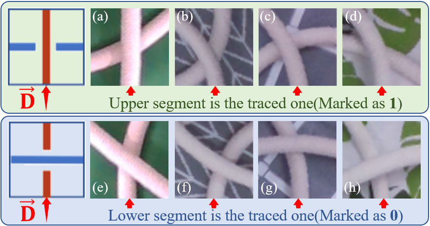

# DLOs Segmentation & Crossings Classification(DLOsSCC)

## Dataset for DLOs segementation | [DLOsS](https://drive.google.com/drive/folders/1Y7g3vsS8e2MvCvQczXEkQI6sUg8tD0Ok?usp=sharing)

## Dataset for DLOs crossings classification | [DLOsCC](https://drive.google.com/drive/folders/1vY-Z_7Dg98PyUO8UzyBso9N5jDXJDqa9?usp=sharing)
This dataset aims be used in DLO crossings classification task. Only crossings consisting of two DLO segments at one point are considered here. 

As shown in the following figure, Arrow 'D' denotes the direction in which the segment is traced. Crossings were cropped by a square boundary, the rotation angle of which depends on the direction of arrow 'D'. 'D' always appears at the midpoint of the bottom boundary. 

After rotation, the direction 'D' in the cropped crossing region is upwards. The DLO segment entered from the midpoint of the bottom boundary is regarded as the target DLO segment. Examples here in the above figure map to (a) and (e) below:

Cropped crossing regions were classified into two categories: UPPER and LOWER. The category represents the anteroposterior position of the two segments in the crossing. Four different backgrounds were used during data collection. 

### Information
- Image size: 50x50(pixels);
- File format: .png(zip);
- Dataset scales: 1883 UPPER images + 1883 LOWER images;